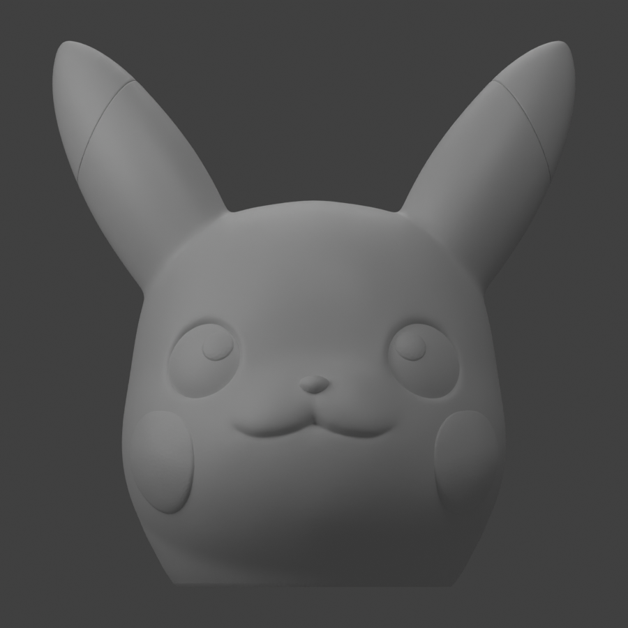
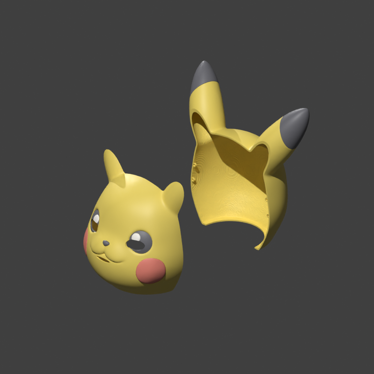
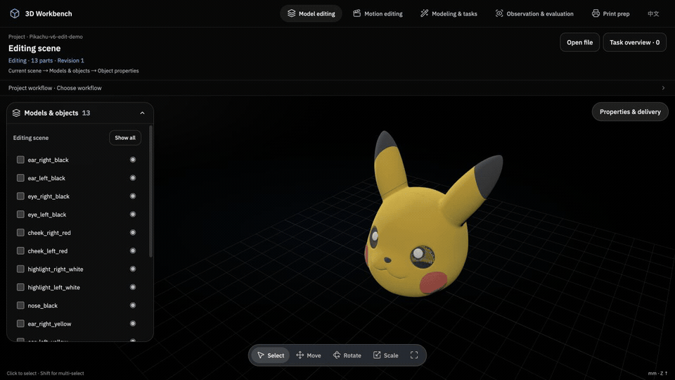
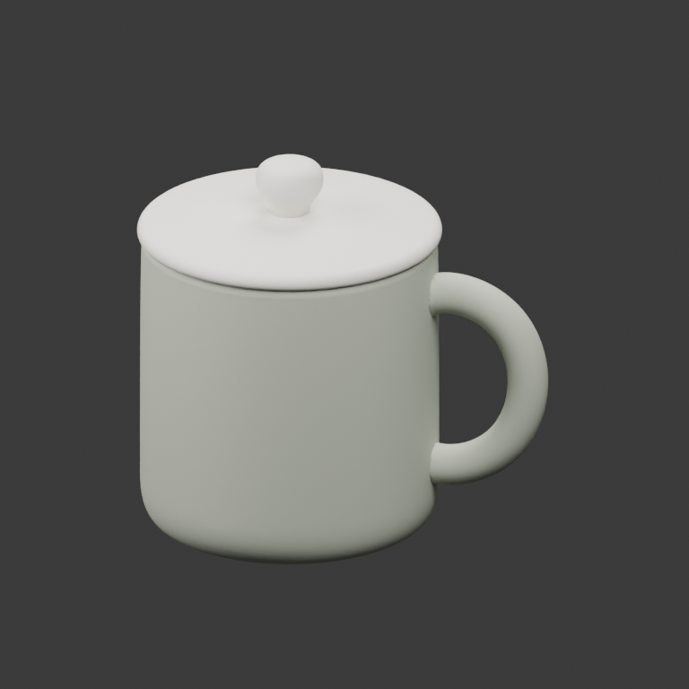
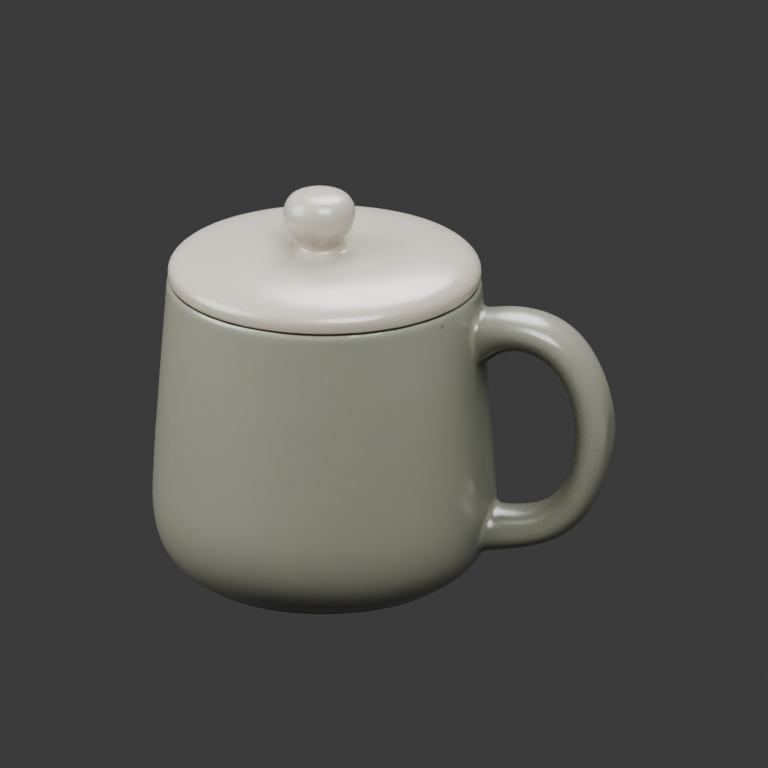
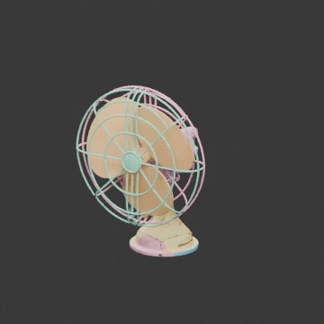
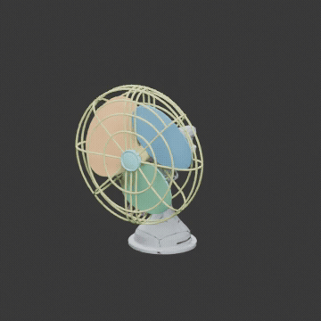
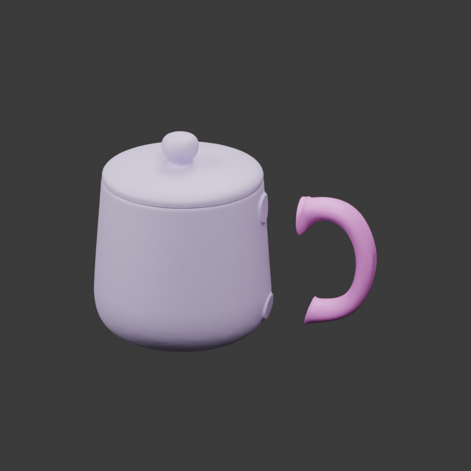

[简体中文](README.zh-CN.md) · [Getting started](docs/GETTING_STARTED.md) · [Agent playbook](docs/AGENT_PLAYBOOK.md)

# Agent 3D Workbench

[](https://discord.gg/r8BVSGtR8H)

**Choose your tools. Let your AI agent model and split parts, then inspect and edit the results together.**

Works with Codex, Claude Code, and other MCP clients. Local code needs no DiT model,
3D service account, or 3D API key. You can also connect your own Hunyuan or Assembly service.
Your agent account/subscription and any 3D service fees are separate.

## Link Everything · connection design (this branch)

The `link_everything` branch adds an independent connection-design prototype to the **HTTP/browser workbench**: manual GLB/STL cuts with paired connectors, AI-assisted mechanism proposals, bounded parametric geometry, and checked motion previews. Open the **Assembly design** workspace, generate a revision, then import its saved GLB back into the editor.

The geometry backend uses a separate Python environment; no private models, credentials or provider endpoints are included. The existing MCP App remains usable but does not embed this local iframe. [Setup, workflows, current limits and validation](experiments/link-everything/README.md).

## What can you do?

You and your agent share one project, model, and selection. These tools run locally; install Blender, Node.js, or slicing software when a task needs them.

| Feature | What you can do |
| --- | --- |
| **View and edit** | Import GLB/STL, select parts, move, rotate, scale, undo/redo, and ask your agent to change only the intended objects. |
| **Model with code** | Have your agent create models with Python/CadQuery/Blender, specify dimensions and parts, and keep the scripts editable. |
| **Split and repair** | Use plane cuts, booleans, connected components, explicit face labels, small-hole repair, and simplification. |
| **Materials and appearance** | Adjust colors, roughness, and metalness per object or material slot; replace textures and run UV/baking tasks. |
| **Functional geometry** | Create cavities, lids, head shells, locating pins/holes, color inserts, and joint modules from explicit dimensions and machining regions. |
| **Rigging and motion** | Bind explicit skeletons and repair weights; edit mechanical joints, bone poses, and keyframes, then preview and export animation. |
| **Inspect and check** | Review real renders, dimensions, and mesh reports; sample collisions at specified joint poses and record issues. |
| **Print preparation** | Orient parts, arrange plates, export STL/3MF projects, and estimate time and material with configured slicing software. |
| **Projects and delivery** | Save and reopen projects, find outputs and versions in Task overview, export GLB/STL, and keep editing generated models. |

Each tool has input requirements. Automatic semantic splitting, natural motion, and physical manufacturability need separate validation.
[Full capabilities and conditions](docs/PUBLIC_CAPABILITIES.md) · [Your first edit](docs/GETTING_STARTED.md)

## Edit together in the workbench


**Select a part → ask your agent to edit → inspect the change → undo.** This cup example shows a shared model, selection, and operation history.
In the current interface, click **Attach selection to chat** to include it in a message; agents can also read the live selection through MCP.
[Follow the first-edit tutorial →](docs/GETTING_STARTED.md)

### Pikachu: from a small STL to a 13-part head-shell draft

The user supplied an STL about **63 mm tall** and asked for a hollow shell, front/back magnetic closure and separate colored parts, then specified a **60 cm head circumference**.
The user inspected each version and refined the request; the agent edited and checked meshes locally, without DiT or a generation API.

| Start: original STL | First delivery: hollow, split shell | v6: overlapping magnet mounts |
| --- | --- | --- |
|  |  |  |

1. **Build the structure:** scale, hollow and open the neck; two shells plus nine colored accessories make 11 parts. Add insertion channels and clearance.
2. **Revise the appearance:** the user dislikes the eye and mouth openings. Switch to eye lattices and hidden ventilation; try inner-eye windows, then restore the original round eyes at the user's request.
3. **Adapt a helmet reference:** v5 separates the yellow ears and adds keyed locators, reaching 13 parts; magnets change to six pairs of Ø10×2 mm.
4. **Correct the mounting arrangement:** the user spots a mismatch with the reference. v6 replaces magnets facing across the seam with overlapping tabs that face the rear cover's inner wall.

**This round delivered a colored GLB, 13 STLs, an editable project and inspection records.** All 13 parts passed watertightness and sampled assembly checks; restoring round eyes left forward vision blocked. Not printed or test-fitted.
Stage images are not shown at the same scale. This completes a digital-draft delivery; a wearable product still requires sightline work and physical validation. [Full journey, version images and limitations →](docs/PIKACHU_HEAD_SHELL.md)

**Keep editing the delivered model in the workbench:**



Move the yellow and black ear pieces together → undo → move the back shell aside to inspect the cavity → restore.
This keyframe replay uses new operations on the v6 model to demonstrate editing and undoing changes to existing parts.

For image-to-3D generation or specialized splitting, you can also choose an API route. The examples below show the differences in actual outputs.

## Create and edit motion in natural language

Describe motion directly in **Codex chat**, such as “Open the drawers in order,” and preview it in **Motion Edit**.
To reference a part or pose, select parts, scrub the timeline and click **Attach selection to chat** above. Then tell Codex “Hold here for two seconds; keep the others unchanged.”
The workbench handles selection, playback and parameter controls; natural-language input stays in chat. Other MCP clients can specify part names and time in their own chat.

The everyday UI keeps selection, playback, undo, save and export close at hand. Manual joints, formulas and keyframes stay collapsed under **Advanced editing**.

You can also edit parameters and keyframes directly. Export an **editable motion ZIP** to keep editing, or an animated GLB for playback.
[Tutorial, reproducible example and input requirements →](docs/MOTION_EDITING.md#direct-motion-with-language)

## Modeling: code or a generation model?

The same cup reference image, processed with two different tools:

| Reference | Codex · Code modeling | Agent + Hunyuan · DiT modeling |
| --- | --- | --- |
|  |  |  |
| Same input image | Python builds a body, handle, lid, and knob: 4 separately editable parts | Hunyuan 3D generates a model with PBR textures; Part can split it afterward |
| Choose when you want… | Explicit dimensions and structure that you can keep adjusting in code | A 3D draft from an image, including surface detail |

The local model simplifies the shape and texture; Hunyuan also changes proportions and gloss.
An image does not establish real dimensions. [Models, prompts, and reproduction steps →](docs/CUP_COMPARISON.md)

## Splitting: local code or a specialized API?

The first two columns use **the same fan**; Hunyuan Part uses **the cup example**.
These show what each tool does, not a three-way ranking on one input.

| GPT-6 · Local splitting | GPT-6 + Assembly · P3RW | Agent + Hunyuan Part |
| --- | --- | --- |
|  |  |  |
| Agent-written mesh code: 7 parts here, retaining source triangles | Specialized segmentation service: 9 parts here, retaining source triangles | Generative part service: 2 parts here—handle, and body + lid + knob |
| Rear grille includes some base faces; rules still need adjustment | Some functional parts remain merged and need further splitting | Lid remains fused; topology changes and segment colors replace PBR textures |
| Specify splitting rules and keep refining the code with your agent | Get a first set of parts from a dedicated segmenter | Add separately editable parts to a generated model |

All three outputs need inspection. More parts do not necessarily mean better segmentation or printable solids.
[Fan GIFs, tokens, time, and estimates](docs/ASSEMBLY_COMPARISON.md) · [Hunyuan Part results and limits](docs/CUP_COMPARISON.md)

API routes need your own service access. [Hunyuan setup](docs/API_GENERATION_DEMO.md) · [Assembly setup](docs/ASSEMBLY_API.md).
The P3RW demo used the native Assembly service; the plugin OpenAPI gateway still needs end-to-end validation.

## Get started

You need Git, [uv](https://docs.astral.sh/uv/), Python 3.12+, Codex desktop, and a Codex CLI with plugin support:

```bash
git clone https://github.com/Hockwang/agent-3d-workbench.git
cd agent-3d-workbench
STUDIO_LANG=en ./install.sh --add
```

Reopen Codex, then ask: **“Open the 3D Workbench for this chat.”**
English and Chinese are supported. Install tools such as Blender when your chosen task needs them.
[Claude Code / other MCP clients, full setup, and your first edit →](docs/GETTING_STARTED.md)

Give the agent an image or model and name the tool you want, for example:

- **Code modeling:** “Use local code to model this reference. Make the body, handle, and lid separately editable. Do not call a generation API.”
- **DiT modeling:** “Generate a model from this image using my configured Hunyuan service.”
- **Splitting:** “Split this model using local code / Assembly P3RW / Hunyuan Part. Show the parts and report anything still fused.” Pick one of the three.

Use **Open file** for an existing model and **Task overview** for generated results.
Select a part, then ask your agent to edit, undo, or export it.
Agents should first read the [playbook](docs/AGENT_PLAYBOOK.md), check available tools, the current workspace and selection, then act and inspect the actual output.

More examples: [Pikachu head shell](docs/PIKACHU_HEAD_SHELL.md) · [Rigging and drawer motion](docs/ASSEMBLY_COMPARISON.md).
[Capabilities](docs/PUBLIC_CAPABILITIES.md) · [Tool reference](docs/TOOLS.md) · [Contributing](CONTRIBUTING.md) · [Feedback](https://github.com/Hockwang/agent-3d-workbench/issues)

Pre-1.0; full desktop workflow tested on macOS, pending on Linux/Windows. [MIT](LICENSE) · [Third-party notices](docs/THIRD_PARTY.md)
