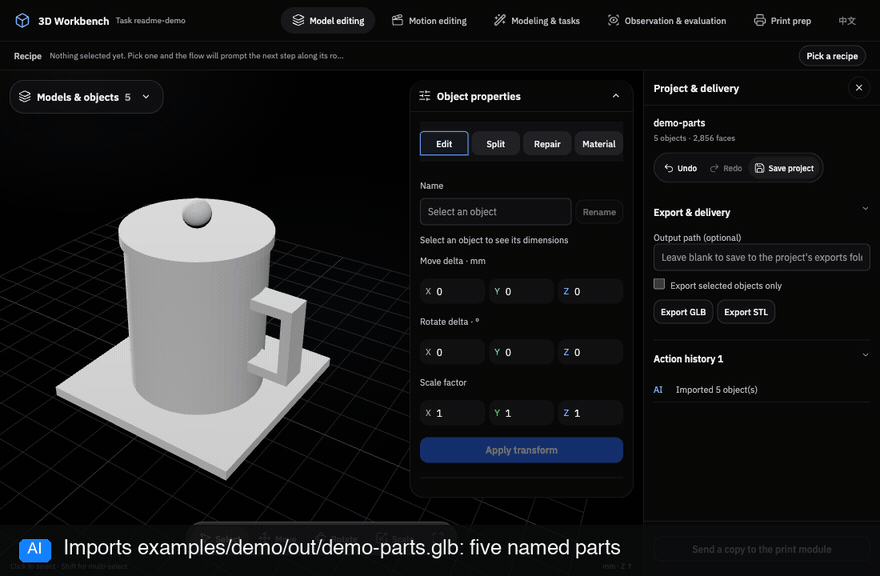

[English](README.md) · [Agent 操作手册](docs/zh-CN/AGENT_PLAYBOOK.md) · [工具参考](docs/TOOLS.md)

# Agent 3D Workbench · 人和 AI 共用的 3D 工作台

**打开模型，点中一个部件，让通用 Agent 和你一起修改。**

你看到的视口和 AI 调用的 MCP 工具操作同一个工程：查看部件、用 Python/CadQuery/Blender
建模、局部修改、检查结果，再保存和导出。Codex 可以在右侧打开工作台；Claude Code 等
MCP 客户端可以使用同一套工具，并在本地浏览器查看模型。

**本地能力不需要 DiT 模型、3D 生成服务账号或 3D API key。** 通用 AI Agent 由宿主提供，
宿主自身可能需要账号或订阅。首次安装需要下载依赖；本地几何操作无需远程 3D 服务。
可选服务适配器需另行配置，不是本教程的前置条件。



动图展示共享选区。当前 Codex 界面需要点击 **「附加选区到对话」** 才会向输入框添加卡片；
选中部件或导入模型不会自动添加。

> **当前状态：** pre-1.0，完整桌面流程已在 macOS 验证；Linux/Windows 有路径适配，
> 完整桌面流程仍待验证。几何检查通过不等于已经可打印、可装配、足够牢固或适合佩戴。

## 中英文支持 / Languages

**支持简体中文和 English。**

| 内容 | 如何选择语言 |
| --- | --- |
| 本教程 | [简体中文](README.zh-CN.md) / [English](README.md) |
| 工作台界面 | 右上角点击 **EN** 切换英文，点击 **中文** 切换中文；页面会重新加载以应用选择。 |
| MCP 返回与后端提示 | 在 MCP 服务器环境中设置 `STUDIO_LANG=zh-CN` 或 `STUDIO_LANG=en`，然后重启／重新连接该服务器。 |
| AI 的聊天回复 | 直接要求 Agent 用中文或英文回答，工作台不覆盖宿主的对话语言。 |

首次安装时可选默认语言：

```bash
STUDIO_LANG=zh-CN ./install.sh --add    # 中文
# 或：
STUDIO_LANG=en ./install.sh --add       # English
```

界面语言优先使用已保存的选择，其次是配置的服务端语言，再其次是浏览器语言。
部分宿主禁止浏览器存储，会隐藏切换按钮；这时设置 `STUDIO_LANG`，重启 MCP 服务后重开工作台。
界面切换会影响后续界面请求的提示语言，但不会改写 MCP 服务器配置。
模型名称、用户输入及已有生成文件保持原内容，不自动翻译。更多设置见 [配置说明](docs/zh-CN/CONFIGURATION.md)。

## 1. 先选使用方式

| 你使用的工具 | 在哪里看模型 | AI 如何操作 |
| --- | --- | --- |
| Codex 桌面端 + CLI | 右侧原生面板，也可打开浏览器 | MCP 工具 + 随插件安装的 skill |
| Claude Code | 本地浏览器 | 同一套 stdio MCP 工具 |
| 其他 MCP 客户端 | 本地浏览器；支持 MCP Apps 的宿主也可内嵌 | 同一套 stdio MCP 工具 |
| 不使用 AI | 本地浏览器或命令行 | `python -m studio.core` |

按部件创建聊天分支需要 Codex；基础编辑和本地建模不依赖它。
界面名称是 **「3D 工作台」**，兼容插件 ID 保持为 `print-prep`。

### 需要准备什么

- Git、[uv](https://docs.astral.sh/uv/)、Python 3.12+；安装脚本还要求 PATH 中有 `python3` 或 `python`。
- 安装进 Codex：Codex 桌面端，以及支持 `codex plugin add` 的 Codex CLI。
- 安装进 Claude Code：`claude` CLI。
- 动画验证／导出或重建前端需要 Node.js 20+。仓库包含预构建界面，普通静态编辑无需 `npm install`。
- 可选：Blender 用于依赖 Blender 的任务与渲染；Bambu Studio 用于其打印机配置、3MF 工程导出和试切。
  **下面的五部件编辑教程不需要这两个软件。**

### 安装到 Codex（macOS/Linux）

```bash
git clone https://github.com/Hockwang/agent-3d-workbench.git
cd agent-3d-workbench
STUDIO_LANG=zh-CN ./install.sh --add
```

脚本创建 Python 环境、把源码软链到 `~/plugins/`、生成本机 `.mcp.json`，并注册
`print-prep@personal`。Blender 和 Bambu Studio 需自行安装。安装后重开 Codex，发送：

> 打开当前聊天的 3D 工作台，进入模型编辑。

只运行 `./install.sh` 会准备本地注册并打印最终添加命令。`STUDIO_LANG` 控制服务端返回语言；
顶部语言按钮控制面板自身语言。

### 安装到 Claude Code

在已克隆的仓库中运行：

```bash
STUDIO_LANG=zh-CN CLAUDE_WORKSPACE_ID=my-model-project ./install.sh --claude
```

这会在 **用户级** 注册 `codex-3d-studio`。使用该注册项的对话共用固定工作区，换聊天不会自动
隔离模型。独立项目请配置不同的项目级 MCP 工作区。然后发送：

> 阅读这个仓库的 README.zh-CN.md 和 docs/zh-CN/AGENT_PLAYBOOK.md。
> 调用 studio_open，presentation="browser"，在浏览器打开 3D 工作台。

### 接到其他 MCP 客户端

先在仓库中运行 `uv sync --locked`，再把下面的服务器配置加入客户端。
**三个路径都要换成真实绝对路径：**

```json
{
  "mcpServers": {
    "print_prep_studio": {
      "command": "/absolute/path/agent-3d-workbench/.venv/bin/python",
      "args": ["/absolute/path/agent-3d-workbench/studio/shell/mcp_server.py"],
      "cwd": "/absolute/path/agent-3d-workbench",
      "env": {"PRINT_PREP_WORKSPACE_ID": "my-model-project", "STUDIO_LANG": "zh-CN"}
    }
  }
}
```

Windows 的解释器改为 `.venv/Scripts/python.exe`。每个独立项目用不同工作区 ID。
宿主不支持 MCP Apps 时，让 AI 用 `studio_open(presentation="browser")` 返回本地页面。
详见 [配置说明](docs/zh-CN/CONFIGURATION.md)。

## 2. 跟着做完第一次编辑

示例由仓库脚本生成，无需下载模型、填写服务 key、安装 Blender、配备 GPU 或打印机。

### A：生成演示模型

在仓库目录运行：

```bash
uv run python examples/demo/make_demo_parts.py
```

终端会打印 GLB 的绝对路径，文件位于 `examples/demo/out/demo-parts.glb`，同时生成五个 STL。
这是用于教学的玩具杯模型，不是食品接触用品设计。

### B：打开模型

1. 让 AI **「打开 3D 工作台」**，或在 Codex 右侧打开同名入口。
2. 点击顶部 **「打开文件」**，选择 `demo-parts.glb`。
3. 顶部应显示 **「当前模型 · 5 个部件」**：`body`、`handle`、`lid`、`knob`、`base`。

也可以让 AI 导入：

> 导入当前仓库演示脚本生成的 demo-parts.glb。先解析绝对路径、读取当前工作区，
> 再导入，并告诉我实际部件名称和尺寸。

导入会追加对象。如果工程已有模型，可在独立项目做这次教程，或明确保留两者。
已经导入的模型点击 **「当前模型」** 就能返回；重复导入会增加一份副本。

### C：选中部件，让 AI 改

在画布或对象列表选中 `handle`。Codex 用户可以点击 **「附加选区到对话」**，
把选区放进消息输入框；无选区时按钮禁用。其他宿主中的 AI 可以通过 MCP 读取实时选区。
发送：

> 先读取当前选区，只把选中的 handle 围绕自身中心等比放大到 1.5 倍，
> 其他部件不变。告诉我修改前后的实际尺寸。

预期把手尺寸约为 **14 × 8 × 23 mm → 21 × 12 × 34.5 mm**。
画布和操作记录应随之更新。如果选区不是把手，AI 应先核对目标再执行。

### D：检查，再撤销

旋转视图，看看把手与杯身的连接。这个放大练习不会自动保持制造配合。可以继续说：

> 检查改过的把手，报告真实几何警告。然后撤销刚才这一步，重新读取尺寸，确认恢复原大小。

也可直接点击界面的 **「撤销」**。工具执行成功或预览好看，都不等于已经能制造或装配。

### E：保存和导出

打开 **「工程与交付」**：

| 操作 | 得到什么 | 用途 |
| --- | --- | --- |
| 保存工程 | `.3dworkbench` 工程包 | 后续继续编辑或转移到另一台机器 |
| 导出 GLB | 保留受支持材质的模型 | 预览、交给其他 3D 工具 |
| 导出 STL | 毫米单位的几何文件 | 切片、制造；不包含颜色和材质 |
| 将副本送到打印模块 | 独立制造副本 | 调朝向、排盘、试切，编辑场景保持装配位置 |

请 AI 返回 **真实输出绝对路径** 并检查文件。日常编辑自动保存在工程工作状态中；
跨机器交付建议显式保存工程包。项目位置与共享规则见 [文件夹工程](docs/zh-CN/FOLDER_PROJECTS.md)。

可在隔离工作区通过真实 MCP 自动复跑「导入 → 修改 → 撤销 → 保存 → 导出 → 重开」：

```bash
uv run python examples/demo/verify_tutorial.py
```

命令会打印报告路径，并把示例产物保留在临时目录。它验证工具流程，不代替原生桌面按钮验收。

### AI 生成的东西在哪里？

点击顶部 **「最近成果」**，按任务名或文件名搜索，然后选择 **「查看结果」** 或 **「输出文件」**。
「文件位置」显示磁盘路径。「接回编辑」会把生成结果加入编辑场景，仅预览不会自动导入。
若要替换原部件，应让 AI 按原对象 ID 替换，避免追加一份重叠模型。

## 3. 再试一次本地建模

可直接把这段交给 AI：

> 只用本地工具制作 L 形支架：底板 80 × 40 × 4 mm，竖板 80 × 4 × 50 mm，
> 底板上两个直径 6 mm、孔距 50 mm 的通孔。用 Python/CadQuery 建模，输出 STEP、STL
> 和 GLB 预览，检查尺寸、实体有效性及通孔，展示结果和报告。不要使用远程生成服务。
> 如果孔的位置或其他尺寸有歧义，先问我。

AI 编写脚本、作为本地任务执行、检查输出，并按需接回编辑。任务和文件在「最近成果」中。
只有使用 Blender 的任务才要求安装 Blender。本地脚本能完成建模，但不保证任意艺术外观，
也不承诺任意照片自动重建成 3D。

| 目标 | 本地途径 | 仍需检查 |
| --- | --- | --- |
| 拆件与网格修补 | 平面切割、布尔、连通块、修复、减面 | 闭合实体、细节和材质是否保留 |
| 添加定位连接 | 显式指定接合面的 `connect-parts` | 壁厚、拔出路径、实物公差 |
| 分色镶嵌 | 指定色板和方向的 `color-inlays` | 适用色块、脱模和装配 |
| 加可动关节 | `install-joint` → `motion-check` | 采样碰撞、装配顺序、实物保持力 |
| 做头套 | 自备／程序建模源 + 头套配方 | 内腔、开口、视线、实际试戴和通风 |
| 动画与姿态 | 显式骨架／关节／关键帧、本地 Blender | 蒙皮变形、碰撞、动作自然度 |
| 准备打印 | 朝向、排盘、导出、可选切片估计 | 真实设备与材料；由人启动打印 |

确切条件与边界见 [对外能力承诺](docs/zh-CN/PUBLIC_CAPABILITIES.md)。
需要服务账号的生成配方属于可选扩展，不属于本地无 key 教程。

## 4. 给 AI Agent 的执行规则

先读这一节，再读 [AGENT_PLAYBOOK.md](docs/zh-CN/AGENT_PLAYBOOK.md)。
以已安装工具的 schema 为准，不要猜参数。

1. **绑定正确工作区。** Codex 使用本聊天的 `CODEX_THREAD_ID` 作为 `workspace_id`；
   原生入口也能从宿主 metadata 获得。不要抄其他对话里的 ID。
   其他宿主使用配置的 `PRINT_PREP_WORKSPACE_ID`，无关项目不要共用工作区。
2. **先读状态。** `studio_open` → `studio_get_state`，读取 `workbench.objects`、
   `workbench.selection`、单位和 `workbench.revision`。输入框附件是旧快照，不能覆盖实时状态。
   编辑对象 ID 与打印部件名称是两套标识。
3. **限定修改范围。** 从最新状态解析对象 ID，以最新 `expected_revision` 调用 `studio_edit`。
   遇到 `revision_conflict` 先重读并重新判断，不盲目重试；需要对象版本时传实际版本。
4. **需要时运行本地任务。** 先看 `studio_capabilities`，通过 `studio_task` 选择可用的本地
   engine/template，再用 `studio_tasks` 查询进度。缺 Blender 或切片器时说明缺失项，不能擅自改用付费服务。
5. **读取验证证据。** 读取报告及产物；`completed` 只表示执行结束，报告仍可能是 `fail`。
   外观任务要实际查看／渲染。采样不碰撞不能推断连续全程安全，也不能推断实物安全。
6. **清楚交付。** 给出文件路径、检查结果及剩余问题。按任务意图导入结果或 `replace` 原部件，
   操作后读回状态。`studio_ui_action` 仅用于归因到人的 UI 按钮，AI 不冒用。

调用 `studio_edit` 的协议示例（不是终端命令；ID 和版本必须替换成 **刚读到** 的值）：

```json
{
  "workspace_id": "CURRENT_WORKSPACE_ID",
  "action": "transform",
  "expected_revision": 3,
  "params": {"ids": ["CURRENT_HANDLE_OBJECT_ID"], "scale": [1.5, 1.5, 1.5]}
}
```

工作台长度通常为 mm、角度为度，以具体工具约定为准。标准 GLB 使用米、Y 向上，
导入／导出会转换；STL 默认毫米、Z 向上。要保留 GLB 的骨骼和动画应走场景导入，
不能把静态导入说成保留动画。需要 `allow_material_loss=true` 的操作须先确认用户接受材质损失。

## 常见问题

| 遇到的问题 | 怎么办 |
| --- | --- |
| 找不到刚才的模型 | 编辑场景点「当前模型」，任务输出点「最近成果」，磁盘文件点「打开文件」。 |
| 没选东西却有旧选区卡片 | 点各卡片的 ×，更新后重开工作台。新版只在点击按钮后附加；删卡片不删模型。 |
| 提示「未绑定工作台」 | 更新并重启 MCP 宿主。Codex 原生入口使用宿主 metadata，其他客户端要配置工作区 ID。「重试」不会重载旧 Python 进程。 |
| 模型出现两份 | 导入是追加操作。撤销重复导入；返回已打开场景用「当前模型」。 |
| Blender／切片器不可用 | 安装并配置对应软件，或先做不依赖它的任务，详见配置文档。 |
| 模型尺寸异常 | 先核对源文件单位与导入设置，不要用无依据缩放掩盖问题。 |
| `revision_conflict` | 重新读取状态、处理冲突，不能原样重发旧操作。 |
| 更新后界面没变 | 重建的前端需重开面板；Python 改动需重启宿主；缓存的 manifest/skill 改动可能需移除后重新添加插件。 |

## 开发与进一步阅读

```bash
make install      # uv sync --locked + npm ci，不注册插件
make test         # Python + JavaScript 测试
make lint         # Python 静态检查
make build        # 重建提交到仓库的界面产物
```

仓库提供可手动启用的 [GitHub Actions 模板](docs/ci.github-actions.yml)，可在 Linux
运行这些检查。首次发布仅提供模板，尚未启用托管 CI。

- [界面入口教程](docs/zh-CN/QUICK_START_UI.md) · [配置](docs/zh-CN/CONFIGURATION.md)
- [工具参考](docs/TOOLS.md) · [Core CLI](docs/zh-CN/CORE_CLI.md) · [架构](docs/zh-CN/ARCHITECTURE.md)
- [任务](docs/zh-CN/WORKBENCH_TASKS.md) · [动画](docs/zh-CN/MOTION_EDITING.md) · [配方](recipes/README.md)
- [贡献指南](CONTRIBUTING.zh-CN.md) · [能力承诺](docs/zh-CN/PUBLIC_CAPABILITIES.md)

## 许可证

项目使用 [MIT License](LICENSE)。第三方组件保留各自许可证，见
[第三方依赖](docs/zh-CN/THIRD_PARTY.md) 及 `studio/web/vendor/` 下的声明。
演示模型生成脚本随仓库提供，用户模型、凭据和本地工作区状态不随仓库分发。
