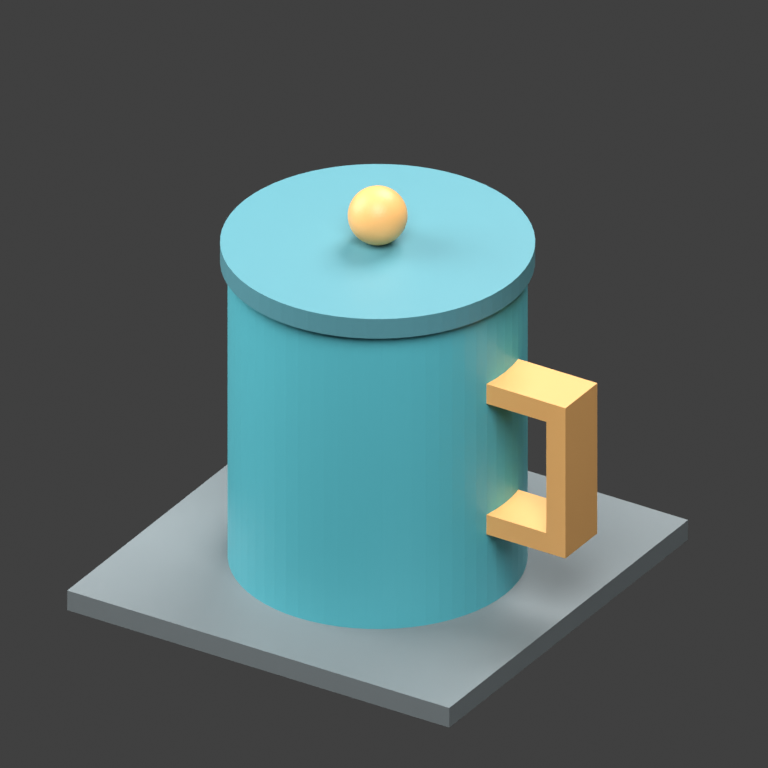

[English](API_GENERATION_DEMO.md) · [README](../README.zh-CN.md)

# 可选生成 API → 本地编辑演示

本教程在无 key 本地能力之外，增加可选的图片建模流程：Agent 把参考图发给已配置的
3D 服务，收到真实 GLB，再在同一个工作台检查和编辑。本地编辑仍可独立使用，
不要求购买生成服务账号。

下图由仓库的原创五部件杯子通过 Blender 渲染，是**输入参考图**，不是 API 生成结果。
上传时只传这张 PNG，生成服务拿不到源几何和部件名称。



## 1. 选择服务

| 路线 | 需要配置 | 本轮验证情况 |
| --- | --- | --- |
| Hunyuan | 实现 `hunyuan-responses` 3D 协议的网关及自己的 API key | 使用已授权网关真实运行，证据见下文 |
| Hi3D | 官方 API 的 Access Key 和 Secret Key | 鉴权和余额查询成功；账户无 API 额度，未跑真实生成 |

“DiT 建模 API”在这里指产品层面的可选生成路线。工作台不附带供应商模型，也不验证其
底层模型架构；只派发专业 3D 请求，不额外调用另一套聊天大模型。

使用 Hunyuan 时，打开 **「建模与任务 → 管理 3D 服务」**，选择 **「Hunyuan 3D / Part」**，
在本机输入有权使用的网关地址和 key，保存后测试连接。
本演示**不提供公开免费端点**；此适配器也不是腾讯云原生 TC3 接口。
普通兼容 OpenAI 文本协议的网关不一定支持 3D 生成。

如果使用环境变量配置，给 MCP 进程注入 `HUNYUAN_API_KEY`，并在仓库外的
`~/.config/codex-3d/services.json` 写入：

```json
{
  "hunyuan": {
    "base_url": "https://YOUR_GATEWAY.example/v1",
    "key_env": "HUNYUAN_API_KEY"
  }
}
```

把地址替换成自己的兼容网关。`key_env` 填变量名，不填密钥实际值。
活动任务结束后，重启 MCP 服务及其已有本地后端，才能加载新环境变量。
Hi3D 的 AK/SK 配置见 [Hi3D 接入](HI3D.zh-CN.md)，当前需使用两个环境变量。

## 2. 只提交一次生成

在 **「建模与任务」** 选择 Hunyuan、**「图片生成模型」**，打开参考 PNG，
选择 `hunyuan-3d-3.1-pro`、GLB、请求 60,000 面、开启 PBR，然后启动一次任务。
调用生成服务可能产生供应商费用。

也可以直接把这段交给 Agent：

> 用已配置的 Hunyuan 3D 服务，根据这张参考图生成一个模型。先检查连接和可用模型，
> 请求带 PBR 的 GLB、60,000 面，只提交一次并保留返回的任务 ID。收到后展示和检查结果，
> 导入当前工程，演示缩小到 0.5 倍再撤销，最后保存和导出。超时不要重复生成，
> 也不要把生成成功说成已分件或可直接打印。

Agent 先调用 `studio_capabilities` 和
`studio_services {"action":"probe","id":"hunyuan"}`，再调用 `studio_task`：

```json
{
  "action": "start",
  "workspace_id": "CURRENT_WORKSPACE_ID",
  "provider": "hunyuan",
  "operation": "image-to-3d",
  "title": "Hunyuan mug demo",
  "inputs": ["/absolute/reference.png"],
  "params": {
    "model": "hunyuan-3d-3.1-pro",
    "output_format": "GLB",
    "face_count": 60000,
    "pbr": true
  }
}
```

工作区与文件路径须替换成真实值。拿返回的**本地任务 ID** 调 `studio_tasks` 轮询；
不能编造 ID，也不能把供应商远端 ID 当本地 ID。
`completed` 表示文件已到达，不代表外观或制造验证通过。

## 3. 找到结果、检查并接回编辑

1. **「最近成果 → 查看结果」** 打开生成模型；**「输出文件」** 提供下载和磁盘位置。
2. 点击 **「接回编辑」**，把结果追加到场景；它不会自动替换旧模型。
   点击 **「当前模型」** 返回编辑视图。
3. 检查尺寸、拓扑和材质。单图背面没有真值；源图来自五个部件，也不代表会生成五个部件。
4. 让 Agent 做一次缩放、撤销、保存 `.3dworkbench` 工程及导出 GLB。
   每次使用新鲜的对象 ID 和 `expected_revision`。
5. 外观验收使用 `studio_observe` 或渲染下载的 GLB；必须看真实图像，不能只看 API 状态。

下面的重放脚本创建独立工作区，校验下载文件哈希，经 MCP 导入、缩小至 0.5 倍、
检查尺寸、撤销并检查恢复、保存工程、导出，再复核 GLB 包围盒。
它不冒充原生 UI 点击测试，也不验证实物打印。

```bash
# 进程环境中已有凭据，并有私有网关配置；此步不生成。
uv run python examples/api_generation/run_demo.py --provider hunyuan --probe \
  --service-config "$HOME/.config/codex-3d/services.json" --out /absolute/api-demo

# 付费生成，只运行一次；有意创建新任务才使用新目录。
uv run python examples/api_generation/run_demo.py --provider hunyuan --generate \
  --service-config "$HOME/.config/codex-3d/services.json" \
  --image docs/assets/api-generation/reference.png --out /absolute/api-demo

# 中断后接着收同一个任务，不再发送生成 POST。
uv run python examples/api_generation/run_demo.py --provider hunyuan --resume \
  --service-config "$HOME/.config/codex-3d/services.json" --out /absolute/api-demo
```

脚本也接受 `--provider hi3d`，默认参数见 [Hi3D 接入](HI3D.zh-CN.md)。
目录已有任务状态时，脚本拒绝重新生成。如果恰好在本地 checkpoint 写入前崩溃，
先检查该目录的任务记录，不能换一个目录自动重试。
如果在导入后中断，应检查已有场景再继续，脚本不会重复追加模型。

## 本轮真实证据

可下载模型、实测检查和外观判断见 [本轮结果报告](API_GENERATION_RESULTS_20260928.md)。
参考图及渲染脚本可以公开复现；账号凭据、私有网关配置、签名下载地址和原始服务响应不公开。

重新生成参考图（仅渲染需要 Blender）：

```bash
uv run python examples/demo/make_demo_parts.py --out /absolute/mug-source
blender -b --python examples/api_generation/render_model.py -- \
  /absolute/mug-source/demo-parts.glb /absolute/reference.png --reference
```

更多协议与边界见 [Hunyuan 接口说明](zh-CN/HUNYUAN_API.md)。
测试连接不会生成模型；`resume` 收回原任务，取消仅停止本地等待，不保证取消远端计费。
费用未知时保持未知。精确尺寸、水密实体、可打印分件仍需各自验证，必要时还需实物测试。
