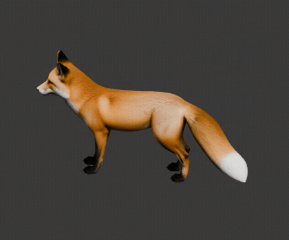
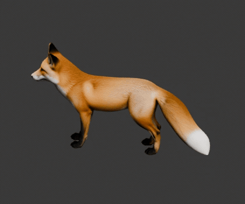
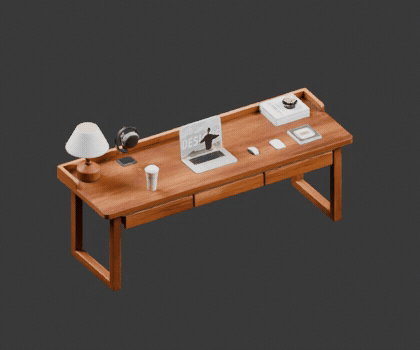
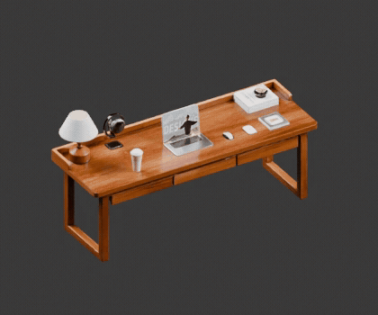
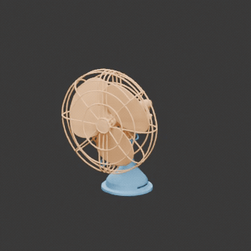

[简体中文](ASSEMBLY_COMPARISON.zh-CN.md) · [Back to README](../README.md)

# The Same Model: GPT-6 Local Workflows and the Assembly API

A first demonstration on 2026-09-29, with 3 inputs and 7 independent routes. The fox tests rigging, the desk tests drawer articulation, and the fan tests segmentation. Within each case, every route receives a source GLB with the same SHA-256 hash; all orchestrating agents use **GPT-6 Astra / ultra**.

**All seven routes produced models that could be opened, but that alone does not qualify any result as acceptable quality.** Below, we show results, defects, tokens, elapsed time, and the basis for price estimates. The source models were generated before this comparison, so their generation costs are excluded. Local routes do not call 3D services; API routes call Assembly's dedicated processing backends.

All GIFs use **12.5 fps (80 ms per frame)**. They present existing results; no generation API was called again. Media production time is recorded separately in the [media record](assets/assembly-comparison/gifs/media-manifest.json) and is excluded from the original experiment's elapsed time and costs.

## 1. Fox Rigging: Posing Works, Natural Motion Remains Unproven

| GPT-6 local Blender rigging | Assembly API · Puppeteer |
| --- | --- |
|  |  |
| 24 bones, 1 skin, 500,000 faces | 35 bones, 1 skin, 500,000 faces |

**2.4-second shared diagnostic motion.** Separate GIFs are not guaranteed to start together on a web page; use the [synchronized side-by-side version](assets/assembly-comparison/gifs/fox-comparison.gif) for timing comparisons. From left to right: GPT-6 local, Assembly API.

The input is a Hunyuan fox with no skeleton or animation. Both routes preserve the original materials and textures, assign weights to every vertex, and use at most 4 bone influences per vertex. The API's `auto` option selected Puppeteer. More bones do not inherently mean better quality.

The motion shown was applied afterward by a shared diagnostic script: left upper front leg +15°, right upper rear leg −15°, head −8°, and tail +12°, followed by the opposite pose. The same source model determines the camera, and neither result's bones nor weights are modified. **Neither original deliverable contains animation**; the moving preview is a diagnostic artifact, not a walking animation generated by the API.

Under the shared pose, the API result shows conspicuous local deformation or a split-like appearance around the front shoulder and chest; the cause has not been confirmed. In the local result, a small-angle single-leg test did not move the far end of the opposite leg. That still does not establish natural continuous motion, correct contact, or freedom from self-intersection. Neither route has passed a natural-gait assessment.

## 2. Desk: All Three Drawers Move, with Different Geometry Processing and Checks

| GPT-6 local segmentation + URDF | Assembly API URDF deliverable |
| --- | --- |
|  |  |
| 3 prismatic joints, with some geometry repaired | 3 prismatic joints, preserving the source triangle partition |

**4-second drawer motion using each result's actual joint ranges.** Separate GIFs are not guaranteed to start together on a web page; use the [synchronized side-by-side version](assets/assembly-comparison/gifs/desk-comparison.gif) for timing comparisons. From left to right: GPT-6 local, Assembly API.

The input is a Seed3D desk with items on its surface and three shallow drawers that are already partly open. Both routes keep the desk body and desktop items fixed and drive the drawers independently.

- **Local:** The first deliverable handled local and world coordinates inconsistently: it omitted the input object's 2× `matrix_world`, leaving segmentation and the added crossbeam at inconsistent scales. The failed result was retained; the second attempt only corrected coordinate handling and material-path packaging. Both attempts are included in the cost and elapsed-time totals. To enable drawer motion, 18,508 / 499,766 source mesh faces (3.70%) were removed, and a crossbeam and drawer walls were added. No triangle intersections between drawers and the fixed body were found across 45 sampled poses, but this is not proof of continuous collision freedom or physical safety. The meshes remain non-watertight, the URDF has no collision elements, and the inertias are placeholders.
- **API:** The articulated result is in the **URDF ZIP**. The separate GLB provided alongside it is byte-identical to the input and must not be treated as the articulated deliverable. The image and interactive page were converted using the URDF's actual joint ranges. To align playback from “closed” to “open,” only the displayed phase was reversed; the original joints were not repaired or rewritten. The source face partition is preserved, with an error below 7×10⁻⁷ after a global translation to ground level; textures were reduced from 4096 to 2048. The service's closed-dimension check failed because a rendering module was missing, and a separate travel check actually checked **0 joints**. This cannot be called a passed collision assessment.

Both results can open, but that does not establish complete interiors or readiness for simulation. The source geometry contains fused regions and open boundaries, and incomplete interior surfaces remain visible when the API result is opened. The local route interprets source units as meters, making the desk approximately 2 m wide; its physical dimensions were not measured.

## 3. Fan Segmentation: Part Count Does Not Establish Correct Functional Parts

| GPT-6 local | Assembly · P3RW | Assembly · Cubepart |
| --- | --- | --- |
|  |  |  |
| 7 parts / 120,000 faces | 9 parts / 120,000 faces | 2 parts / 69,384 faces |

**4-second explode-and-return sequence: a presentation animation with no semantic corrections.** Separate GIFs are not guaranteed to start together on a web page; use the [synchronized side-by-side version](assets/assembly-comparison/gifs/fan-comparison.gif) for timing comparisons. From left to right: GPT-6 local, P3RW, Cubepart.

The input is a Seed3D fan previously simplified to 120,000 faces, with no materials or textures. Colors in the images distinguish parts only; matching colors across routes do not indicate matching semantic parts.

| Check | Local | P3RW | Cubepart |
| --- | --- | --- | --- |
| Source geometry | Triangles, orientation, and coordinates preserved, with no omissions or duplicates | Final GLB preserves source triangles and coordinates | Face count reduced by 42.18%; overall dimensions along all three axes shrink by approximately 4% |
| Main issues | Rear grille incorrectly includes 1,138 faces from the base; jagged neck boundary | Motor, shaft, support, and base remain merged; front and rear grilles are also merged | Fan head, grille, and blades are merged into one part; the other part is the base + support |
| Assessment for this run | Semantic segmentation is unacceptable | Some functional parts are separated, but under-segmentation remains | The default two parts do not meet the functional-part separation requirement |

P3RW used P3-SAM + random walker (cuDSS, with no fallback). The table reports the **final 9-part result** after the API cleaned up tiny labels, not the internal raw label count. The Cubepart request did not specify part names, so the service used the default `base,moving_part`, with a simplification-ratio parameter of 0.2 enabled. **This does not establish Cubepart's capability ceiling when explicit part names are supplied.** None of the three routes was given a fixed part count, and there is no manually annotated per-face ground truth, so we report neither IoU nor an overall win rate. The input itself contains many fragments and open boundaries; this run did not deliver printable solids.

## Tokens, Elapsed Time, and Estimated Prices

These figures freeze at each independent experiment's first terminal event and use the last cumulative token counter before it; multiple cumulative snapshots are not added together. Later review or documentation turns in the same chat are excluded. `Cached input` is a subset of `Total input`; reasoning tokens are already included in output and are not added again. See [usage.json](assets/assembly-comparison/usage.json) for the complete machine-readable record.

| Route | Session elapsed time | Total input | Of which cached input | Output | Orchestrating agent: estimated standard API equivalent (USD) |
| --- | ---: | ---: | ---: | ---: | ---: |
| Fox · local | 11 min 58 sec | 1,487,807 | 1,390,848 | 21,031 | $3.41 |
| Fox · API | 14 min 38 sec | 2,522,276 | 2,451,584 | 21,326 | $4.22 |
| Desk · local | 15 min 17 sec | 2,733,414 | 2,657,920 | 24,805 | $4.65 |
| Desk · API | 15 min 20 sec | 2,363,992 | 2,301,184 | 22,056 | $4.03 |
| Fan · local | 10 min 27 sec | 1,736,200 | 1,664,256 | 17,790 | $3.27 |
| Fan · P3RW | 14 min 24 sec | 2,813,122 | 2,733,440 | 23,616 | $4.71 |
| Fan · Cubepart | 7 min 40 sec | 1,065,996 | 1,023,232 | 12,967 | $2.10 |

**These prices are neither subscription charges nor the total costs of the API routes.** They use GPT-6 Astra standard API rates checked on 2026-09-29, per million tokens: $10 for uncached input, $1 for cache reads, and $50 for output. All cache-write counts in this run were 0. Every observed individual request had less than 272k input tokens, so the table uses the short-context scenario. A session's cumulative input exceeding 272k does not mean an individual request triggered long-context pricing. The logs do not identify the actual billing service tier, so they cannot establish the real bill. [Official pricing](https://developers.openai.com/api/docs/pricing) · [Model and long-context documentation](https://developers.openai.com/api/docs/models/gpt-6-astra)

```text
Estimated USD = ((Total input − Cached input) × 10 + Cached input × 1 + Output × 50) / 1,000,000
```

GPT-6 still submits, receives, and checks the API results, so API routes also incur orchestrating-agent usage. The estimates above **exclude** inference inside the services, GPU/infrastructure, 3D API fees, input generation, and the main session's preparation and shared presentation work. An unavailable service fee does not mean the service is free. Internal company API cost records are not published with this report.

Elapsed time covers each independent session from launch to its final response, including reasoning, tool waits, execution fixes, and that route's own checks. API node execution time is not the duration used in this table: for example, approximately 245 seconds for the desk and 28 seconds for P3RW, while the sessions also include receiving and validating results. Multiple routes ran in parallel on the same machine, and result-retrieval endpoint differences had to be handled during first use. These figures therefore document this demonstration; they are not a stable latency benchmark.

## Interpretation and Reproduction

1. **Freeze the inputs.** The two or three routes for each case receive the same source GLB, with no previous rigs, previous segmentations, or joint ground truth supplied. All models are Y-up; their SHA-256 hashes are in the public usage.json.
2. **Execute independently.** The 3 local routes use only local code and geometry tools. Each of the 4 API routes submits one real task, without rerolling generated results. The failed local desk attempt is retained, along with one coordination clarification permitting execution-error fixes; the statistics include the repair overhead.
3. **Separate validation from presentation.** First inspect the actual artifacts, face counts, weights, joints, and materials, then present them with shared cameras. Diagnostic animations and exploded views are deterministic scripts applied afterward, not original service deliverables. A render does not establish acceptable quality.
4. **Limit the conclusions.** Three examples are not statistically representative. The routes differ in default granularity, cleanup steps, and permission to modify geometry. Do not use this demonstration to claim that either the API or GPT-6 wins across the board.

This run called the existing **native Assembly workflow service interface**, not the plugin's OpenAPI gateway. It demonstrates that these backends can process the inputs and deliver results; **it does not replace authentication and end-to-end validation of the plugin gateway**. Private transport scripts, endpoints, credentials, service bills, and raw logs are not included in the open-source repository.

To connect optional services to your own workbench, first follow the [Assembly configuration guide](ASSEMBLY_API.md) to configure a deployment you are authorized to use. After reading `studio_capabilities`, the agent can use `studio_task` with `provider: "assembly"` and select `rig-glb`, `assemble`, or `segment`; for Cubepart, add `cutBackend: "cube"`. The input must be a model URL the service is authorized to access, and its actual coordinate axes must be preserved. Local routes still do not require these accounts.

After submission, save the task ID and use that same ID to poll or resume result retrieval. Do not immediately resubmit after a timeout. `configured`, HTTP 200, or “received a GLB” is not a complete success assessment.

This repository publishes actual mesh renders, sanitized statistics, and [diagnostic/measurement scripts](../examples/assembly_comparison/README.md). Large source models and local interactive packages are not published as public downloads. The scripts are not general-purpose automatic modeling algorithms and cannot reconstruct the design decisions made by an agent in a particular run.
