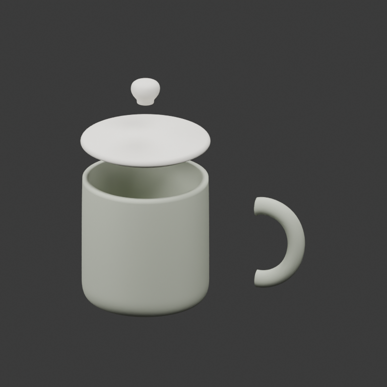

[简体中文](CUP_COMPARISON.zh-CN.md) · [README](../README.md)

# One image, two 3D workflows

The same independently generated reference goes through two complete workflows:
**Codex-authored local modeling → editable parts** and **Hunyuan generation →
Hunyuan Part → editable parts**. Both finish in this workbench. The API route can
split models too; part splitting is not an exclusive capability of local modeling.

| Shared input | Codex + local Python | Hunyuan 3D 3.1 Pro |
| --- | --- | --- |
|  |  |  |

The input was created with the built-in image-generation tool, not rendered from
either result. [Exact prompt](assets/cup-comparison/reference-prompt.txt).
Both routes received the same PNG, SHA-256
`3931bd17e4593f39242c25697a33c33e0e3566aa08d054f9db024f77ccb8b74d`.
This is one demonstration, not a benchmark or a general quality ranking.

## What happened after splitting

| Local: four authored components, exploded | API: two generated segments, handle moved |
| --- | --- |
|  |  |

The local agent intentionally constructed **body, handle, lid and knob** as separate
objects. This is decomposition during modeling, not evidence of automatic semantic
segmentation of an arbitrary mesh. Hunyuan Part returned **handle** and
**body + lid + knob**. The lid is still fused to the body in that result. Two parts
would not inherently be worse than four, but these two do not provide an independently
removable lid.

| Measured item | Local route | Generation + Part route |
| --- | --- | --- |
| 3D generation service | None | `hunyuan-3d-3.1-pro`, then `hunyuan-3d-1.5-part` |
| Geometry | 41,710 faces across 4 objects | 60,000 faces before splitting; 1,735,888 across 2 parts afterward |
| Topology after geometric vertex welding | All 4 parts watertight; no boundary or nonmanifold edges | Each part has 6 boundary edges, 0 nonmanifold edges; neither is watertight |
| Materials | Authored plain ceramic colors | PBR generation; Part outputs segment vertex colors with no texture images |
| Parameters | Explicit 88 mm body diameter, 90 mm body height; invented hidden cavity | No physical scale inferred from image; display normalized to 114 mm height |
| Single-part edit | Move handle +25 mm, undo, export, save and reopen: passed | Same workflow: passed |
| API submissions | 0 | 1 generation + 1 split; neither was regenerated |
| Service elapsed time, including collection | Not applicable | 211.88 s generation + 78.56 s split |
| Gateway receipt amounts | No 3D-service charge | 2.16 generation, 0 split; currency unspecified |

The Python execution duration in [machine-readable evidence](assets/cup-comparison/report.json)
excludes Codex reasoning, script authoring and rendering. It is **not** a fair
end-to-end speed comparison with API time. Host-agent and reference-image usage are
not included in the costs. A zero split receipt does not imply future free access.

Visual review: the local model approximates the silhouette with clean revolved
surfaces and a swept handle, but simplifies the ceramic texture and profile. The API
retains more image-like surface variation, yet changes proportions and gloss. Part
keeps the overall arrangement but changes topology, colors and face count. Both
remain reviewable drafts; neither was printed or checked for food contact, strength
or assembly retention. Watertightness alone does not provide those guarantees.

## Try the results first

Download the [model bundle](https://github.com/Hockwang/agent-3d-workbench/releases/download/demo-cup-20260928/cup-comparison.zip).
Open these files with the workbench's **Open file** button:

- `local/scene.glb`: four local components; individual STL files are alongside it.
- `api/generated.glb`: untouched textured API output.
- `api/split.glb`: untouched two-part result, using the provider's segment colors.
- `api/display-114mm.glb`: the same split result, explicitly rescaled for display.

Choose the handle, then ask the agent to move only that object and undo the change.
Use **Current model** to return to the editor; newly run task outputs are under
**Recent results**. Import appends, so do not repeatedly import to navigate.

## Reproduce each route

First install the repository dependencies. The local route needs no 3D-service key.
The API route needs a gateway implementing the [Hunyuan 3D Responses protocol](HUNYUAN_API.md),
your own authorized credentials in the launching process's environment and a private
`services.json`. The author's company endpoint/key is not a shared public service.
[Connection setup](API_GENERATION_DEMO.md#1-choose-a-service).

```bash
mkdir -p /absolute/cup-demo
cp docs/assets/cup-comparison/reference.png /absolute/cup-demo/reference.png

# Local reconstruction, no generation API.
uv run python examples/cup_comparison/run_comparison.py local \
  --out /absolute/cup-demo

# Paid API generation: requests FBX so the Part service can consume its result.
uv run python examples/cup_comparison/run_comparison.py generate \
  --out /absolute/cup-demo --service-config "$HOME/.config/codex-3d/services.json"

# Paid/plan-dependent splitting, referencing the saved generation task.
uv run python examples/cup_comparison/run_comparison.py split \
  --out /absolute/cup-demo --service-config "$HOME/.config/codex-3d/services.json"

# No API calls: verify independent editing through MCP in isolated workspaces.
uv run python examples/cup_comparison/verify_edits.py --out /absolute/cup-demo
```

Re-running an unchanged stage polls/resumes its existing task; an ambiguous submission
is not retried. Changing the local source creates a new local revision. Generation
is nondeterministic: `verify_edits.py` checks this recorded example's four/two objects
and identified handle; review a newly generated split before adapting that check.
The verifier deliberately refuses to overwrite a prior verification workspace.

The published local script is the reconstruction Codex authored **after viewing this
specific image**. Replacing the PNG does not make this fixed script model a different
object. For a new object, ask the agent to author a new local model.

## Prompts and MCP steps for agents

**Local prompt:** “Look at this reference. Build an approximate cup locally using
Python/CadQuery/Blender, with body, handle, lid and knob independently editable.
Declare chosen dimensions and assumptions about hidden geometry. Use no 3D generation
API. Check the solids, show renders, then demonstrate one-part editing and undo.”

**API prompt:** “Use my configured Hunyuan service to generate this same image once,
requesting FBX for the Part service. Then run Part once, inspect its actual groups,
materials and topology, and import the result for one-part editing. Report any fused
parts, missing texture or open edges; do not equate completion with acceptance.”

Call `studio_capabilities` and `studio_services(action:"probe", id:"hunyuan")`
before the API route. Generate with `studio_task` (`provider:"hunyuan"`,
`operation:"image-to-3d"`, `output_format:"FBX"`, `face_count:60000`, `pbr:true`).
After completion, split with:

```json
{
  "action": "start",
  "workspace_id": "CURRENT_WORKSPACE_ID",
  "provider": "hunyuan",
  "operation": "segment",
  "params": {"source_task": "LOCAL_GENERATION_TASK_ID"}
}
```

Use fresh workspace/object IDs and revisions for editing. Inspect the result before
naming its parts. These scripts use real stdio MCP, but do not automate native UI
button clicks. [Verification and limitations](API_GENERATION_RESULTS_20260928.md).
