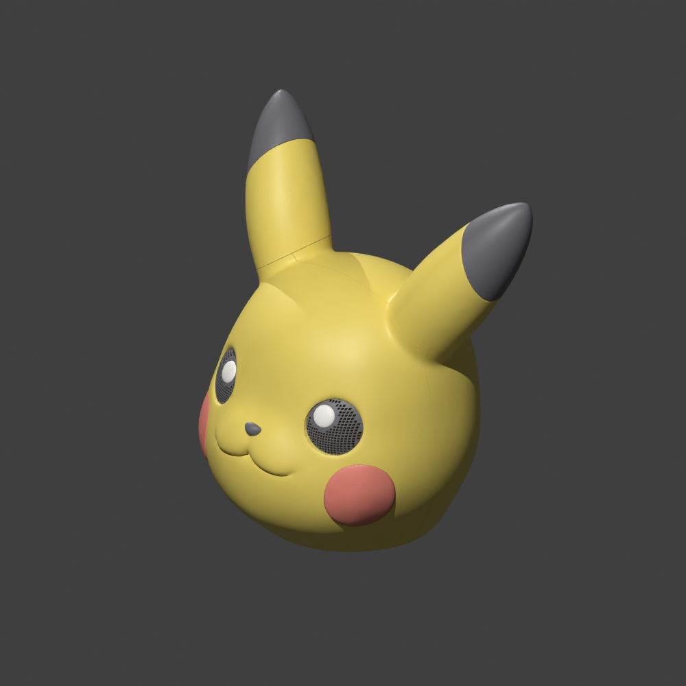
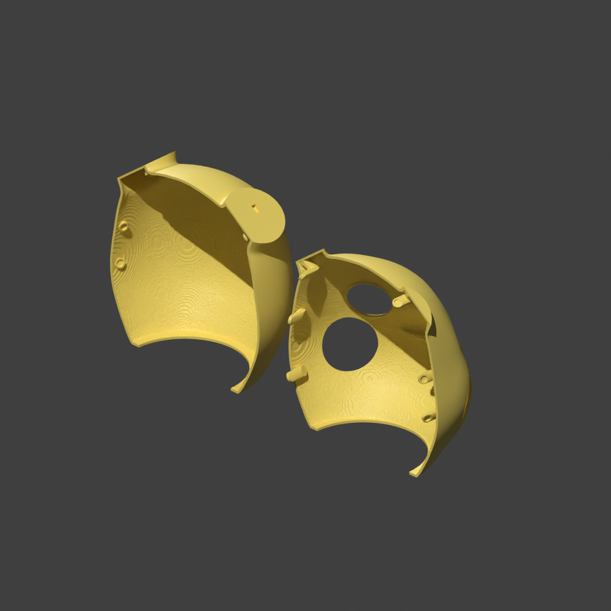
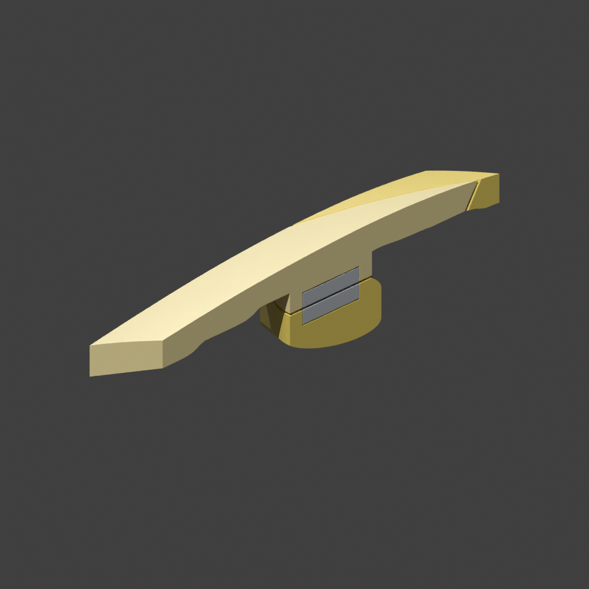
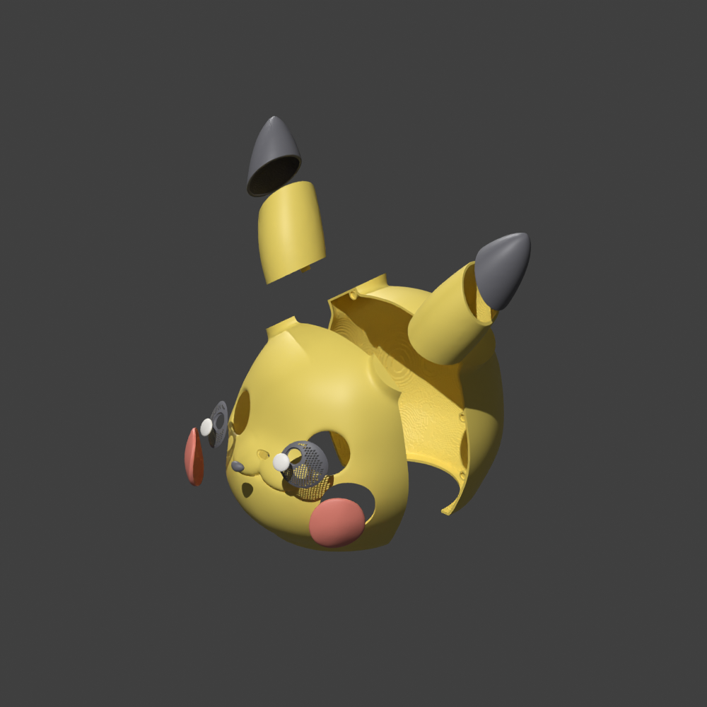

[简体中文](PIKACHU_HEAD_SHELL.zh-CN.md) · [Back to README](../README.md)

# Pikachu head shell: from a user request to the v6 design draft

This case started with a small STL. The user wanted a shell that could go over a
person's head, then refined the requirements while inspecting results: move the
viewing openings, preserve round eyes, separate the ears, adapt another helmet's
connectors, and correct the magnet mounting arrangement. The agent inspected meshes,
wrote missing geometry operations, generated versions and revised them in response.

This account reconstructs the original September 22–23, 2026 conversation titled
“评估3D工作台打印需求” and its delivery records. The final version shown is v6. Processing
ran locally without DiT or a hosted 3D-generation API; the user supplied the character model.

## The original request

The user asked to hollow the model into a head shell, split it into front and back
halves, leave room for magnets at the seam, and separate parts by color if possible.
They confirmed it should go over a person's head, specified a 60 cm circumference,
and allowed viewing, ventilation and neck openings that were hidden in the design
where possible. Magnets initially used a Ø6×3 mm specification, later changed to
Ø10×2 mm after a helmet reference was introduced. The user also explicitly asked the
agent to implement missing workbench capabilities while completing the model.

The input, `PikachuGoku_3MF.stl`, measured about **60.71 × 46.51 × 63.38 mm** and contained
10 separate closed solids. **The STL held no recoverable color values.** Names and
colors for eyes, cheeks and ear tips came from an explicit part plan, not automatic
material recovery. Separate solids were not yet detachable parts: they overlapped
the body and still needed sockets, clearances and insertion paths.

## The assembled model and its internal structure

| Assembled | Inside the two shells | Magnet mount section |
| --- | --- | --- |
|  |  |  |

All three images render the delivered meshes. The open view shows the rear cover
on the left and front shell on the right. Grey blocks in the section are magnet
placeholders, excluded from the printed-part count. Processing marks remain visible
on the inner walls and seams; human appearance acceptance is still pending.

## How the conversation changed the model

### 1. Scaling and separating parts also required assembly paths

The agent scaled the exterior to approximately 400 mm wide, built a cavity around
the declared 600 mm circumference and padding allowance, opened the neck, split the
front and back shells, and added magnet mounts. The first delivery had 11 parts:
two yellow shells and nine colored accessories, with four pairs of Ø6×3 mm magnets.

Checks found that the ear tips needed installation clearance and the red cheeks'
undercuts prevented insertion along the planned direction. The agent added clearance
and insertion channels and checked removal paths. The assembly order became explicit:
**install colored accessories while the shells are open, then close the two halves.**
The result progressed from separate meshes to sampled assembly paths.

### 2. The user rejected the viewing openings and asked for mask references

Early openings cut through the eye outlines, and an extra mouth hole changed the
expression. After the user pointed this out, the agent researched mask openings,
used black eye lattices with separate white highlights, and hid ventilation slots
in the original smile.

Sightline checks then found that the yellow face still blocked forward rays from
the provisional human eye points even with the lattices removed: the character's
eyes were farther apart. Offered inner-eye windows or a changed mouth expression,
the user chose the former. In v3, extending the inner eye corners let forward rays
pass from those assumed eye points.

### 3. Preserving the round eyes meant updating the sightline result

The user then explicitly requested that the original eye shape remain unchanged.
v4 removed the inner-eye extensions, restored the round outlines, kept lattices
inside the black eyes, and retained the white highlights and closed smile.

Restoring the appearance also restored the obstruction. The agent recorded
**`forward_blocked`** again instead of carrying v3's passing result into v4. This
limitation remains in v6; actual eye positions, viewing windows and a physical fit
test still need work.

### 4. A helmet reference led to separate yellow ears and keyed locators

The user supplied an `Anti Venom Helmet` model and reference images, clarifying that
they were references for continued Pikachu work. Its dimensions could not simply be
copied; the user chose to retain the 60 cm head-circumference design and borrow the
connection approach.

v5 separated the two yellow ears from the main shell, increasing the count from 11
to **13 parts** while keeping black ear tips separate. Ear roots gained keyed plugs
with a clipped corner to prevent reversed insertion and sockets with clearance.
The shells changed to **six pairs of Ø10×2 mm magnets**. The ear keys locate parts;
fit coupons or adhesive are still needed, and snap-fit retention has not been tested.

**This is a real render of v5 meshes moved apart to explain the part layout.** v6
kept the same STL bytes for 11 accessories and changed the two shells' magnet mounts.
This v5 image does not show the final v6 magnet arrangement.

### 5. Correct magnet dimensions did not mean the correct mounting arrangement

The user pointed out that the magnets were not installed as shown in the reference.
v5 placed opposing magnets on seam end faces. The reference called for tabs extending
from the front shell, with the rear cover sliding over them so magnets faced its inner wall.

v6 rebuilt the mounts accordingly: six tabs crossing the seam, six pairs of Ø10×2 mm
magnets and matching pockets in the rear cover. Checks covered whether complete
mounts intruded into the declared head envelope, whether the shells could separate,
and whether magnets could be inserted along their installation axes. A model-loading
fix was also integrated so this multipart model could be opened and inspected inside
the workbench.

The final delivery included a colored GLB, 13 STLs, an editable project, real renders
and version-bound inspection records. **The unresolved sightline result stayed with
the delivery; watertightness and sampled assembly checks did not replace it.**

## What this means for using the workbench

The full loop was: **a person states the goal → the agent inspects the source → writes
needed geometry operations → shows the model in the workbench → the person identifies
an appearance or structure issue → the agent revises and reruns relevant checks → saves
a new version.** Users can communicate through natural language and reference images;
the agent must translate those requests into explicit parameters, meshes and inspectable results.

This case combined custom development with model fabrication. Work during the task
added shell processing, assembly-path checks, eye and sightline handling, and ear-root
interfaces. The “Start your own head-shell task” section below distinguishes the
currently published base workflow from the custom showcase implementation.

## v6 structure and dimensions

The 13 parts are the front shell, rear cover, two yellow ears, two black ear tips,
two black eye lattices, two white highlights, two red cheeks and one nose. Magnets
are purchased hardware and are not counted as printed parts.

| Design item | Case parameter |
| --- | --- |
| Declared head circumference | 600 mm; actual head shape, eye positions and padding need calibration |
| Exterior including ears | Approximately 400 × 306.49 × 417.63 mm, width × depth × height |
| Magnets | Six pairs: twelve Ø10×2 mm magnets, not printed parts |
| Pockets | Ø10.2×2.2 mm; at least 2 mm of floor material and a 2.2 mm side-wall design value |
| Interfaces | 0.4 mm magnet face gap; 0.25 mm tab clearance allowance |

## Recorded digital checks and remaining work

These results come from this delivery's verification records. While preparing this
page, the GLB and all 13 STL SHA256 values were checked against those records. The
model was not regenerated and assembly sampling was not rerun for this documentation update.

| Check | Recorded result |
| --- | --- |
| Part meshes | All 13 single-component, watertight and positive-volume; workbench readback found zero boundary or non-manifold edges |
| Declared head envelope | Zero intersection with every part; applies only to the specified ellipsoid |
| Accessory assembly | 1,333 discrete poses passed; not a continuous collision guarantee |
| Shell removal | 61 poses from 0 to 30 mm in 0.5 mm steps, without interference |
| Magnet insertion | Each of 12 magnets sampled along its installation axis from 0 to 25 mm in 0.5 mm steps, without interference |
| Sightline | **`forward_blocked`: the yellow face shell still blocks forward vision from the provisional eye points** |
| Physical validation | Not split for a printer bed, sliced, printed or worn; magnet retention, adhesive strength, tolerances and ventilation remain unverified |

GLB SHA256: `427845497cfe5263060a3b8da12c5c822e9005bdc05ae90d7349fb128396891f`.
Images match the original delivery; see [image provenance and hashes](assets/pikachu-head-shell/README.md).

## Start your own head-shell task

The public plugin includes the [base head-shell workflow](HEAD_SHELL.md) and an
[older 11-part parameter example](../examples/head-shell/README.md) bound to one source SHA.
The **13-part v6 design and its Ø10×2 mm overlapping magnet mounts were custom work
and are not included in the current built-in template**. The old parameters are
not a reproduction script for this showcase.

Provide your own source model and ask your agent:

> Make a head-shell design draft from my character model. First inspect its orientation,
> dimensions and parts, and confirm which exterior features must be preserved. Use a
> 60 cm circumference as an initial design assumption. Plan the front/back shells,
> accessories and connectors; adapt local structures to this actual model. Save a
> separate version and report watertightness, cavity clearance, assembly paths,
> sightlines and unverified items separately. Show the exterior and inside in the
> workbench. If sightlines conflict with the character's appearance, explain the
> conflict instead of marking the design ready to wear.

The source STL, GLB and project archive are not included in this repository. This
page demonstrates a workflow and the limits of digital checks. For a directly
reproducible bundled model, start with the [five-part README tutorial](../README.md).
